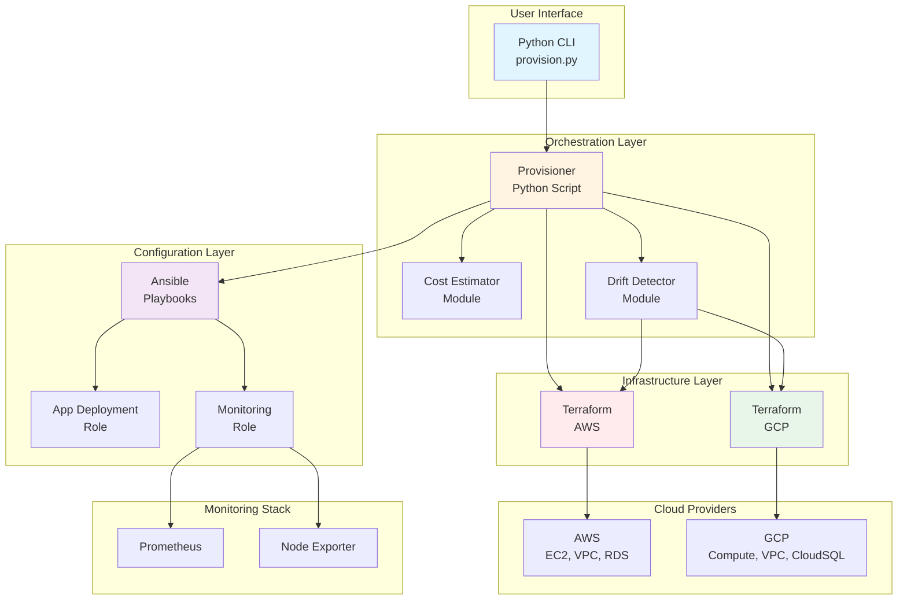

# One-Click Multi-Cloud Provisioner 🚀

A comprehensive DevOps automation tool that provisions complete infrastructure on AWS and GCP using Terraform, Ansible, and Python. Deploy production-ready infrastructure with monitoring, databases, and CI/CD integration in a single command.

## 📋 Table of Contents

- [Overview](#overview)
- [Key Features](#key-features)
- [Architecture](#architecture)
- [Prerequisites](#prerequisites)
- [Quick Start](#quick-start)
- [Setup Steps](#setup-steps)
- [Usage Examples](#usage-examples)
- [Project Structure](#project-structure)
- [Cost Estimation](#cost-estimation)
- [Drift Detection](#drift-detection)
- [CI/CD Integration](#cicd-integration)
- [Roadmap](#roadmap)
- [Contributing](#contributing)
- [License](#license)

## 🎯 Overview

The One-Click Multi-Cloud Provisioner automates the entire infrastructure provisioning lifecycle:

1. **Infrastructure as Code**: Terraform manages VPCs, subnets, compute instances, and databases
2. **Configuration Management**: Ansible deploys applications and monitoring agents
3. **Cost Optimization**: Real-time cost estimation using cloud provider APIs
4. **Drift Detection**: Automated monitoring of infrastructure configuration drift
5. **CI/CD Ready**: Jenkins and GitHub Actions workflows included

## ✨ Key Features

- **Multi-Cloud Support**: Deploy to AWS and GCP with the same command
- **Environment Management**: Separate configurations for dev, staging, and prod
- **Automated Monitoring**: Prometheus and Node Exporter pre-configured
- **Database Support**: Optional RDS (AWS) or CloudSQL (GCP) provisioning
- **Cost Estimation**: Real-time cost estimates before provisioning
- **Drift Detection**: Automated alerts for infrastructure configuration drift
- **CI/CD Integration**: Ready-to-use Jenkins and GitHub Actions workflows
- **Production Ready**: Security groups, encryption, and best practices included

## 🏗️ Architecture



## 📦 Prerequisites

### Required Software

- **Python 3.9+**
- **Terraform 1.0+**
- **Ansible 2.9+**
- **AWS CLI** (for AWS deployments)
- **Google Cloud SDK** (for GCP deployments)

### Cloud Provider Accounts

- **AWS Account** with appropriate IAM permissions
- **GCP Project** with billing enabled and required APIs enabled

### Authentication

- **AWS**: Configure credentials using `aws configure` or environment variables
- **GCP**: Authenticate using `gcloud auth application-default login`

## 🚀 Quick Start

### 1. Clone the Repository

```bash
git clone https://github.com/yourusername/one-click-multicloud-provisioner.git
cd one-click-multicloud-provisioner
```

### 2. Install Dependencies

**Windows (using winget):**
```powershell
python setup.py install-deps
```

**Linux/Mac:**
```bash
pip install -r requirements.txt
```

### 3. Provision Infrastructure

```bash
# AWS Staging Environment
python scripts/provision.py --cloud aws --env staging

# GCP Production Environment with Database
python scripts/provision.py --cloud gcp --env prod --enable-db
```

## 📝 Setup Steps

### Detailed Installation

1. **Install Python Dependencies**
   ```bash
   pip install -r requirements.txt
   ```

2. **Install Terraform**
   - Download from [terraform.io](https://www.terraform.io/downloads)
   - Or use package manager: `winget install HashiCorp.Terraform`

3. **Install Ansible**
   ```bash
   pip install ansible ansible-core
   ```

4. **Configure AWS Credentials**
   ```bash
   aws configure
   # Or set environment variables:
   # export AWS_ACCESS_KEY_ID=your_key
   # export AWS_SECRET_ACCESS_KEY=your_secret
   ```

5. **Configure GCP Credentials**
   ```bash
   gcloud auth application-default login
   gcloud config set project YOUR_PROJECT_ID
   ```

6. **Set Terraform Variables** (Optional)
   - Create `terraform/aws/terraform.tfvars` for AWS
   - Create `terraform/gcp/terraform.tfvars` for GCP

## 💡 Usage Examples

### Basic Provisioning

```bash
# Provision AWS dev environment
python scripts/provision.py --cloud aws --env dev

# Provision GCP staging environment
python scripts/provision.py --cloud gcp --env staging
```

### With Database

```bash
# Provision AWS production with RDS
python scripts/provision.py --cloud aws --env prod --enable-db

# Provision GCP staging with CloudSQL
python scripts/provision.py --cloud gcp --env staging --enable-db
```

### Cost Estimation Only

```python
from modules.cost_estimator import CostEstimator

estimator = CostEstimator("aws", "staging", enable_db=True)
cost_summary = estimator.estimate()
estimator.print_summary(cost_summary)
```

### Drift Detection

```bash
# Check for configuration drift
python scripts/drift_detector.py --cloud aws

# With email alerts
python scripts/drift_detector.py --cloud gcp --email-config email_config.json
```

### Sample CLI Output

```
============================================================
🚀 Starting Multi-Cloud Provisioning
   Cloud: AWS
   Environment: STAGING
   Database: Enabled
============================================================

✅ All prerequisites met

💰 Estimating infrastructure costs for AWS...
============================================================
💰 COST ESTIMATION SUMMARY
============================================================
┌──────────────────┬──────────────────────────────┬─────────────────────┐
│ Component        │ Details                      │ Monthly Cost (USD)  │
├──────────────────┼──────────────────────────────┼─────────────────────┤
│ Compute          │ 1x t3.large                  │ $60.74              │
│ Storage          │ 50 GB                        │ $5.00               │
│ Data Transfer    │ Estimated                    │ $10.00              │
│ Database         │ db.t3.small                  │ $24.82              │
├──────────────────┼──────────────────────────────┼─────────────────────┤
│ TOTAL (Monthly)  │                              │ $100.56             │
│ TOTAL (Yearly)   │                              │ $1,206.72           │
└──────────────────┴──────────────────────────────┴─────────────────────┘

🔧 Initializing Terraform for AWS...
✅ Terraform initialized successfully

📋 Running Terraform plan for AWS...
✅ Terraform plan completed successfully

🚀 Applying Terraform configuration for AWS...
✅ Terraform apply completed successfully

📦 Running Ansible playbooks...
✅ Ansible deployment completed successfully

============================================================
✅ Provisioning completed successfully!
============================================================

📊 Infrastructure Outputs:
   instance_public_ips: ['54.123.45.67']
   vpc_id: vpc-0123456789abcdef0
```

## 📁 Project Structure

```
one-click-multicloud-provisioner/
├── terraform/
│   ├── aws/
│   │   ├── main.tf              # AWS infrastructure definition
│   │   ├── variables.tf         # AWS variables
│   │   ├── outputs.tf           # AWS outputs
│   │   └── .gitignore
│   └── gcp/
│       ├── main.tf              # GCP infrastructure definition
│       ├── variables.tf         # GCP variables
│       ├── outputs.tf           # GCP outputs
│       └── .gitignore
├── ansible/
│   ├── playbooks/
│   │   └── deploy.yml           # Main deployment playbook
│   ├── roles/
│   │   ├── app_deployment/      # Application deployment role
│   │   └── monitoring/          # Monitoring setup role
│   ├── inventory/               # Dynamic inventory files
│   └── ansible.cfg              # Ansible configuration
├── scripts/
│   ├── provision.py             # Main provisioning script
│   └── drift_detector.py        # Drift detection script
├── modules/
│   ├── cost_estimator.py        # Cost estimation module
│   └── drift_detector.py        # Drift detector module wrapper
├── .github/
│   └── workflows/
│       └── ci.yml               # GitHub Actions workflow
├── Jenkinsfile                  # Jenkins pipeline
├── requirements.txt             # Python dependencies
├── setup.py                     # Setup script with winget
└── README.md                    # This file
```

## 💰 Cost Estimation

The cost estimator module provides real-time cost estimates using:

- **AWS Pricing API**: Fetches current pricing for EC2, RDS, and storage
- **GCP Billing API**: Estimates costs for Compute Engine and CloudSQL
- **Fallback Pricing**: Uses cached pricing if APIs are unavailable

### Features

- Instance type recommendations based on environment
- Storage and data transfer estimates
- Database cost calculations
- Monthly and yearly projections
- Cost breakdown by component

## 🔍 Drift Detection

The drift detector monitors infrastructure for configuration drift:

### Features

- Automated Terraform plan execution
- Detailed drift reports
- Email alerts (optional)
- Historical drift tracking
- Integration with CI/CD pipelines

### Usage

```bash
# Basic drift detection
python scripts/drift_detector.py --cloud aws

# With email notifications
python scripts/drift_detector.py --cloud gcp \
  --email-config email_config.json
```

## 🔄 CI/CD Integration

### GitHub Actions

The included workflow provides:

- Automated linting and validation
- Terraform syntax checking
- Ansible syntax validation
- Manual provisioning triggers
- Multi-cloud testing

**Setup:**
1. Add AWS credentials to GitHub Secrets: `AWS_ACCESS_KEY_ID`, `AWS_SECRET_ACCESS_KEY`
2. Add GCP service account key to GitHub Secrets: `GCP_SA_KEY`
3. Workflow will run on push/PR and can be triggered manually

### Jenkins

The Jenkinsfile includes:

- Multi-stage pipeline
- Parallel testing
- Terraform validation
- Ansible syntax checks
- Automated cleanup

**Setup:**
1. Install required Jenkins plugins: Pipeline, Ansible, Terraform
2. Configure cloud credentials in Jenkins
3. Create a pipeline job pointing to the Jenkinsfile

## 🗺️ Roadmap

### Phase 1 (Current)
- ✅ AWS and GCP provisioning
- ✅ Basic monitoring setup
- ✅ Cost estimation
- ✅ Drift detection

### Phase 2 (Planned)
- [ ] Azure support
- [ ] Kubernetes cluster provisioning
- [ ] Advanced monitoring (Grafana, AlertManager)
- [ ] Multi-region deployments
- [ ] Disaster recovery automation

### Phase 3 (Future)
- [ ] Web UI dashboard
- [ ] Infrastructure visualization
- [ ] Cost optimization recommendations
- [ ] Automated scaling policies
- [ ] Blue-green deployment support

## 🤝 Contributing

Contributions are welcome! Please follow these steps:

1. Fork the repository
2. Create a feature branch (`git checkout -b feature/amazing-feature`)
3. Commit your changes (`git commit -m 'Add some amazing feature'`)
4. Push to the branch (`git push origin feature/amazing-feature`)
5. Open a Pull Request

### Development Guidelines

- Follow PEP 8 for Python code
- Use Terraform best practices
- Write Ansible roles with idempotency
- Add tests for new features
- Update documentation

### Code Style

- Python: Use `black` formatter, max line length 120
- Terraform: Use `terraform fmt`
- Ansible: Follow Ansible best practices

## 📄 License

This project is licensed under the MIT License - see the [LICENSE](LICENSE) file for details.

## 🙏 Acknowledgments

- HashiCorp for Terraform
- Red Hat for Ansible
- Prometheus community
- AWS and GCP for their excellent APIs

## 📞 Support

- **Issues**: [GitHub Issues](https://github.com/yourusername/one-click-multicloud-provisioner/issues)
- **Discussions**: [GitHub Discussions](https://github.com/yourusername/one-click-multicloud-provisioner/discussions)
- **Email**: support@example.com

## ⚠️ Disclaimer

This tool provisions real cloud infrastructure that will incur costs. Always review the cost estimates and ensure you have proper access controls in place. The authors are not responsible for any costs incurred from using this tool.

---

**Made with ❤️ by the DevOps community**

